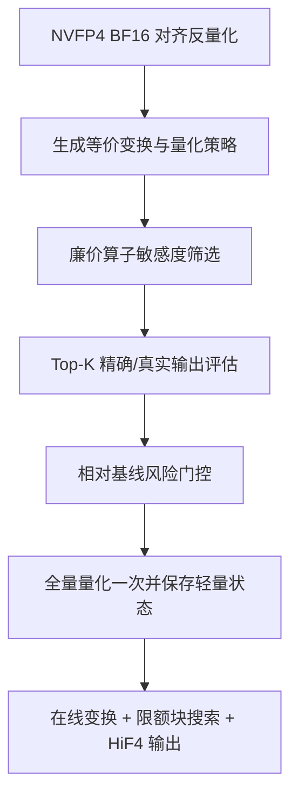

# HiF4 最优算法设计：风险约束的算子感知双层量化

> 适用赛题：NVFP4 → HiF4 的 Linear 与 Attention 量化  
> 约束：总运行时间不超过 5 分钟；所有参数严格合法；Linear 禁止计算 `A @ W` 并利用输出反推 `Q(A)`  
> 设计版本：RC-OABQ v1.0，2026-08-25

## 1. 核心结论

在测试分布未知、评分按逐 case 相对 MSE 改善率累加的条件下，不存在一个对所有隐藏用例都严格最优的固定量化规则。最合理的竞赛级方案不是继续堆叠固定技巧，而是构造一个**标准 HiF4 保底、算子误差驱动、带最差 case 门控和时间预算的自适应候选系统**。

本文将该方案命名为：

**风险约束的算子感知双层量化**（Risk-Constrained Operator-Aware Bilevel Quantization，RC-OABQ）。

推荐主路径由五部分组成：

1. **HiF4 块内精确求解器**：标准候选 + E6M2 小邻域/裁剪候选 + 固定一级尺度下的精确层级求解。
2. **Linear 合法输出代理**：使用 64 维块协方差和低秩 Hessian 重排序，不计算 `A @ W`。
3. **Attention 真实输出校准**：先用廉价敏感度代理筛选，再以短窗口真实 Attention MSE 决定最终策略。
4. **等价变换搜索**：Linear 使用成对缩放/排列，可选低成本蝶形旋转；Attention 使用 K-centering、成对 Q/K 缩放与 head 内排列。
5. **风险与预算控制**：任何增强都与标准 HiF4 比较；收益不稳定时回退；候选数和精修块数由张量规模动态限流。

当前 `solution-0818.py` 已具备层级量化、SmoothQuant、排列、K-centering 和困难块精修。下一阶段最重要的新增不是继续扩大 `refine_ratio`，而是：

- Attention 改用真实 Attention 输出和 softmax-Jacobian 敏感度；
- Linear 从逐通道对角重要度升级为 rank-2 块 Hessian；
- scale 搜索从固定 offset 升级为数据驱动候选；
- 所有全局策略改用相对标准基线的风险目标选择。

## 2. 目标函数与设计边界

单个 case 的得分为：

$$
Score_i=1-\frac{MSE_{player,i}}{MSE_{std,i}}.
$$

因此平均绝对 MSE 最小并不等价于总分最高。算法必须特别防止在 $MSE_{std}$ 很小的 case 上发生轻微退化。

Linear 的真实目标为：

$$
\mathcal L_{lin}=\left\|AW^T-\hat A\hat W^T\right\|_F^2,
$$

但规则禁止计算校准 `A @ W` 并据此拟合激活量化。Linear 只能使用 $A^TA$、$W^TW$、幅值统计和量化残差构造合法代理。

Attention 的目标为：

$$
\mathcal L_{attn}=\left\|
Attn(Q,K,V)-Attn(\hat Q,\hat K,\hat V)
\right\|_F^2.
$$

题面没有禁止在 Attention 校准中计算 QK 或完整 Attention，因此应直接利用最终输出误差。实现必须复刻判题器的 GQA 映射、$1/\sqrt d$ 缩放、mask、softmax 精度和输出布局；若官方实现与常规 SDPA 不同，以官方实现为准。

## 3. 总体架构



这是一个双层优化：外层搜索全局变换与量化策略，内层为每个 64 元素块求合法 HiF4 参数。

$$
\theta^*=\arg\min_{\theta\in\Theta}
\operatorname{Risk}\left(
\mathcal L_{operator}(Q_{HiF4}(T_\theta(X)))
\right),
$$

其中 $T_\theta$ 是缩放、排列、旋转或 centering；内层 $Q_{HiF4}$ 严格输出合法的五类参数。

## 4. 通用 HiF4 块内求解器

### 4.1 标准候选必须完整保留

对每个 64 元素块 $x_b$，先生成标准 HiF4 的完整候选：

$$
s_0=Q_{E6M2}(\operatorname{BF16}(\max|x_b|/7)).
$$

标准的 `scale_factor / scale_lv2 / scale_lv3 / sign / mant` 必须整体保留，不能只把 $s_0$ 放入候选后重新求解，因为官方层级决策和舍入细节也可能影响基线结果。

### 4.2 数据驱动的 E6M2 候选

设 $c_0$ 为 $s_0$ 的 E6M2 code。Weight 的困难块使用：

$$
\mathcal C_b=\operatorname{unique}\left\{
c_0-3,c_0-2,c_0-1,c_0,c_0+1,c_0+2,c_0+3,
Encode(x_{(2)}/7),Encode(x_{(4)}/7)
\right\},
$$

其中 $x_{(k)}$ 是绝对值第 $k$ 大的元素。后两类候选允许牺牲少量 outlier，改善其余 60 余个元素。所有 code 截断到 `[0,254]`，绝不产生 NaN 编码 255。

在线 Activation/Q/K/V 只保留最多 4 个候选，例如：

$$
\{c_0-1,c_0,c_0+2,Encode(x_{(2)}/7)\}.
$$

### 4.3 固定一级尺度下精确求解层级指数

每个 64 块由 8 个二级组组成，每个二级组包含两个 4 元素三级组。固定一级尺度 $s$ 后，对第 $(g,h)$ 个 4 元素组建立三张局部损失：

$$
L_{g,h}(k)=\sum_{r=1}^{4}w_{g,h,r}
\left(x_{g,h,r}-Q_{mant}(x_{g,h,r};s2^k)\right)^2,
\quad k\in\{0,1,2\}.
$$

若二级指数 $e_2=0$，两个三级组分别在 $k\in\{0,1\}$ 中选择；若 $e_2=1$，则分别在 $k\in\{1,2\}$ 中选择：

$$
C_g(0)=\sum_h\min\{L_{g,h}(0),L_{g,h}(1)\},
$$

$$
C_g(1)=\sum_h\min\{L_{g,h}(1),L_{g,h}(2)\}.
$$

取 $e_{2,g}=\arg\min C_g(e_2)$，再回溯两个 $e_3$。这与枚举 8 种状态等价，但只需三张局部损失表，适合批量向量化。

### 4.4 低秩 Hessian 重排序

上述精确求解使用可分离的对角权重。对 Linear 的少量候选，再用块 Hessian 重排序：

$$
H_b\approx \operatorname{diag}(d_b)+U_b\Lambda_bU_b^T,
$$

$$
L_H(e)=\sum_j d_{b,j}e_j^2+
\sum_{r=1}^{R}\lambda_r(u_r^Te)^2,
\quad R=2.
$$

低秩项只负责候选重排序，不进入层级动态规划，因此不会破坏快速精确求解结构。

### 4.5 局部安全门控

仅精修标准候选归一化误差最大的块。候选至少满足：

$$
L_{candidate}\le(1-\delta)L_{standard}
$$

才替换标准结果。建议 Weight 的 $\delta=0$～1%，在线张量为 2%～3%，防止代理误差的微小随机改善换来算子输出退化。

## 5. Linear：合法的块二阶输出感知量化

### 5.1 成对等价变换

对输入通道施加共享坐标变换：

$$
A'=AD^{-1}PR,\qquad W'=WDPR,
$$

其中 $D$ 为正对角缩放，$P$ 为排列矩阵，$R$ 为块正交变换。由于 $PP^T=RR^T=I$：

$$
A'W'^T=AW^T.
$$

因此无需把 Weight 参数逆排列回原通道；在线 Activation 必须应用同一个坐标系中的逆缩放和相同排列/旋转。

推荐候选集合：

| 参数 | 候选 |
| --- | --- |
| Smooth 强度 $\alpha$ | `0, 0.25, 0.50`，粗选后测试最优值 `±0.125` |
| 排列 $P$ | Identity、max-pressure、joint-pressure、1 轮边界交换 |
| 旋转 $R$ | 默认 Identity；仅测试 H4/H8 蝶形旋转 |

其中：

$$
D_j=\operatorname{clip}\left(
\frac{a_j^\alpha}{w_j^{1-\alpha}},d_{min},d_{max}
\right),
$$

$a_j$ 和 $w_j$ 分别为校准 Activation 与 Weight 的通道峰值。排列特征使用：

$$
z_j=\left(\log(a_j/D_j),\log(w_jD_j)\right),
$$

将双侧压力接近的通道装入同一 HiF4 层级块，并在相邻 64-block 边界做有限交换。

H64/FWHT 不应作为默认主路径：它需要 6 轮蝶形运算，鲲鹏 CPU 在线成本可能抵消收益。只有 H4/H8 在校准代理上分别稳定改善超过 3%/5%，且计时预算允许时才启用。

### 5.2 不计算 `A @ W` 的输出误差代理

令 $E_W=W'-\hat W'$、$E_A=A'-\hat A'$。使用：

$$
H_A=\mathbb E[A'^TA'],\qquad H_W=\hat W'^T\hat W'.
$$

按 64 维构造块对角近似，并保留 rank-2 低秩项。Weight 与 Activation 的合法代理分别为：

$$
L_W=\sum_{o,b}e_{W,o,b}^TH_{A,b}e_{W,o,b},
$$

$$
L_A=\sum_{t,b}e_{A,t,b}^TH_{W,b}e_{A,t,b}.
$$

归一化后采用保守组合：

$$
L_{lin}^{proxy}=\left(\sqrt{\bar L_W}+\sqrt{\bar L_A}\right)^2.
$$

整个过程只使用 `AᵀA`、`WᵀW` 和量化残差，不生成 `A @ W`，也不利用输出反推激活量化，符合赛题限制。

### 5.3 校准与在线流程

1. 从校准 Activation 统计峰值、二阶矩和每个 64-block 的 rank-2 协方差。
2. 在采样 Weight 行和 Activation 行上评估 `D/P/R` 候选，标准 Identity 策略始终保留。
3. 使用逐校准样本相对代理损失和最差样本门控选择全局策略。
4. 只对选中坐标系下的完整 Weight 做一次全量 HiF4 量化。
5. 从量化后 Weight 生成在线 Activation 使用的 `diag + rank-2` 重要度。
6. 在线对 Activation 执行一次 `D⁻¹/P/R`，再对困难块做有限候选重排序。

`activation_state` 推荐只保存少量 CPU Tensor：`multiplier`、`permutation`、可选 `rotation_mode/sign`、`hessian_diag`、`hessian_u_scaled`、候选 policy、shape 和版本。Hessian 统计使用 float16，排列使用 int32；状态节点数远低于 4096。

## 6. Attention：真实输出驱动的 Q/K/V 联合校准

### 6.1 可利用的严格不变性

对每个 KV head，令所有映射到它的 GQA Query head 使用相同的通道变换：

$$
Q'=QDPR,\qquad K'=KD^{-1}PR.
$$

则量化前 $Q'K'^T=QK^T$。

K 还可减去同一 head 的通道中心 $c$：

$$
Q(K-\mathbf1c^T)^T=QK^T-(Qc)\mathbf1^T.
$$

右侧第二项对同一个 query 的所有 key 是相同常数，因此 softmax 不变。可校准选择 `none / mean / midrange`。该中心必须由当前在线 K 动态计算，而不是保存校准中心。

V 不允许使用通道排列、旋转或 centering，因为判题器不会对 Attention 输出执行逆变换或偏置加回。

### 6.2 softmax-Jacobian 敏感度

在 64～96 token 的校准窗口上计算：

$$
P=softmax(QK^T/\sqrt d),\qquad O=PV.
$$

对第 $i$ 个 query 和第 $j$ 个 key，定义对 logit 扰动的近似输出敏感度：

$$
g_{ij}=P_{ij}^2\left\|V_j-O_i\right\|_2^2.
$$

由此构造 Q/K 的逐特征重要度：

$$
I_Q[d]\approx\frac1d\sum_{i,j}g_{ij}K_{j,d}^2,
$$

$$
I_K[d]\approx\frac1d\sum_{i,j}g_{ij}Q_{i,d}^2.
$$

GQA 下按 KV head 聚合其对应的多个 Query head。该敏感度比简单的 Q/K 二阶矩更接近最终 Attention 输出，可直接用于 scale 候选和困难块排序。

### 6.3 两阶段候选选择

候选策略为：

$$
\theta=(center,\alpha,P,R,policy_Q,policy_K,policy_V,\gamma).
$$

为避免笛卡尔积爆炸，采用坐标式两阶段搜索：

1. 用 Jacobian 加权 Q/K/V 代理筛选 `centering + smooth`；
2. 固定最佳平滑，比较 Identity 与 2 种 head 内排列；
3. 只有代理改善充分时测试 H4/H8；
4. 固定 Q/K 后比较 2～3 种 V policy；
5. 每阶段仅保留标准策略和 Top-2/Top-3，送入真实 Attention 输出评估。

对每份校准样本计算：

$$
r_i(\theta)=
\frac{MSE(O_i,\hat O_i^\theta)}
{MSE(O_i,\hat O_i^{std})+\epsilon}.
$$

最终不是按张量重构 MSE，而是按相对标准 Attention 输出 MSE 选策略。

### 6.4 Logit temperature 补偿

量化可能系统性改变 logits 方差。对中心化 logits：

$$
L_c=L-mean(L,-1),\qquad \hat L_c=\hat L-mean(\hat L,-1),
$$

逐 head 拟合：

$$
\gamma_h=
\frac{\langle L_c,\hat L_c\rangle}
{\|\hat L_c\|_2^2+\epsilon}.
$$

将 $\gamma_h$ 限制在 `[0.95,1.05]`，把 $\sqrt\gamma$ 合入 Q 和 K multiplier。只比较 `1.0 / fitted / 邻近值`，并以真实 Attention MSE 决定是否启用。它不是严格等价变换，因此必须使用更严格的最差 case 门控。

### 6.5 V 的偏差感知量化

Attention 权重行和为 1，V 的跨 token 共同量化偏差不会被平均消除。V 候选损失增加均值误差项：

$$
L_V=\sum_t\|e_t\|_2^2+
\lambda T\left\|mean_t(e_t)\right\|_2^2.
$$

低成本实现为：

1. 每个 token-block 仅生成标准与一个裁剪候选；
2. 先按局部 MSE 选择；
3. 计算 feature-wise 平均残差；
4. 对局部损失近似持平的候选做一次向量化替换，使平均残差下降；
5. 只有真实 Attention 校准稳定改善时才启用，否则 V 保持标准动态量化。

## 7. 风险约束选择器

对全局候选使用：

$$
J(\theta)=mean(r_i)+0.5\,std(r_i)
+2\max(0,\max_i r_i-1.005).
$$

推荐接受规则：

| 策略 | 平均相对改善下限 | 最差校准 case 容忍度 |
| --- | ---: | ---: |
| 仅 scale policy | 1% | 不超过 1% 退化 |
| Smooth / centering | 1% | 不超过 0.5% 退化 |
| 排列 | 2% | 不超过 0.5% 退化 |
| H4/H8 旋转 | 3% / 5% | 不允许退化 |
| Temperature | 2% | 不允许退化 |

至少 75% 的校准样本应有改善。若标准基线 MSE 极小，使用绝对误差下限保护分母；样本数太少或分布漂移明显时自动选择 Identity/标准 policy。

## 8. 五分钟内的预算化实现

候选搜索不能固定覆盖所有 block，应按规模分配预算。设总 block 数为 $B$、每块候选数为 $M$：

$$
K_{refine}=\min\left(
\lceil\rho B\rceil,
K_{cap},
\left\lfloor\frac{Budget_{ops}}{M\cdot C_{block}}\right\rfloor
\right).
$$

推荐初始参数：

| 对象 | 最大候选数 | 初始精修比例 | block 上限 | 在线额外变换 |
| --- | ---: | ---: | ---: | --- |
| Weight | 7 | 15%～20% | 65,536 | 无 |
| Activation | 4 | 6%～10% | 16,384～32,768 | D/P，R 条件启用 |
| Q | 4 | 5%～8% | 8,192～16,384 | D/P |
| K | 4 | 8%～10% | 12,288～24,576 | center + D/P |
| V | 3 | 5%～8% | 12,288～24,576 | 默认无 |

工程内控目标为 220～235 秒，至少留出 20% 平台抖动空间。关键性能措施：

- 预生成 255 个有限 E6M2 值和相邻 code 的 LUT；
- 候选 code 作为一个 Tensor 维度批量计算，避免 Python block 循环；
- 困难块 `topk` 后按 chunk 处理，控制峰值内存；
- 无变换路径融合 NVFP4 反量化与 HiF4 分组；
- 使用 `torch.inference_mode()`，避免重复 `nan_to_num/normalize/device copy`；
- state 只保存 CPU、有限、无梯度的少量 Tensor；
- 不自动迁移到 NPU/GPU，鲲鹏 CPU 下设备搬运风险大于收益。

## 9. 六个接口的最终职责

```text
hif4_calibration_and_quantize_weight
  统计 A → 搜索 D/P/(R) → 块 Hessian 风险选择 → 全量 W 量化一次
  返回 weight_params + 轻量 activation_state

hif4_dynamic_quantize_activation
  NVFP4→BF16 对齐 → D⁻¹/P/(R) → H_W 感知困难块搜索 → HiF4Params

hif4_calibration_attention
  统计 Q/K/V → Jacobian 代理筛选 → 短窗口真实 Attention 重排序
  → 选择 center/D/P/(R)/V policy/temperature → q/k/v_state

hif4_dynamic_quantize_q
  Q 变换 → I_Q 感知困难块搜索 → HiF4Params

hif4_dynamic_quantize_k
  在线 K-centering → K 变换 → I_K 感知困难块搜索 → HiF4Params

hif4_dynamic_quantize_v
  标准或校准启用的偏差感知 policy → HiF4Params
```

## 10. 推荐落地顺序与消融

不要一次提交所有增强。每日提交次数有限，应采用单变量消融：

| 版本 | 唯一主要改动 | 预期价值 | 风险 |
| --- | --- | --- | --- |
| v4-A | Attention 真实输出重排序 | 最大，直接对齐评分 | 需复刻官方 Attn |
| v4-B | softmax-Jacobian Q/K importance | 中高，在线几乎零增量 | 代理稳定性 |
| v4-C | Weight 数据驱动 scale 候选 | 中，在线零增量 | 校准耗时 |
| v5-A | Linear rank-2 块 Hessian 重排序 | 中高，合法且输出相关 | 内存/矩阵统计 |
| v5-B | Temperature + V 偏差策略 | 中，针对 Attention 尾差 | 必须严格门控 |
| v6 | H4/H8 条件旋转与内核融合 | 潜在高收益 | CPU 时延 |

每次记录 Linear/Attention 分项得分、负分 case 数、校准时间、在线时间、峰值内存和策略启用比例。若无法获得逐 case 分数，至少使用本地留一法：每次用部分校准样本选策略，其余校准样本模拟隐藏测试。

## 11. 明确不建议的方向

- 全量搜索 255 个 E6M2 scale：时间成本远大于边际收益；
- 保存完整 $C\times C$ Hessian 或稠密旋转矩阵：状态和在线成本过高；
- Linear 计算 `A @ W`、`A @ ΔW` 后直接拟合激活参数：存在违规风险；
- 默认启用 H64/FWHT：CPU 在线时延不可控；
- 对 V 做排列、旋转或 centering：无法恢复输出坐标或偏置；
- 只按所有元素总体 MSE 选候选：与逐 case 相对得分错配；
- 取消标准回退以追求平均收益：极易因少数 case 负分丢失总分；
- 依赖跨在线调用的可变全局状态：判题器会复制 state，调用顺序也不应成为算法假设。

## 12. 最终推荐配置

若只实现一套兼顾分数、风险和时延的版本，建议采用：

- **通用量化器**：标准完整候选 + 4/7 个数据驱动 E6M2 候选 + 精确层级 DP + 困难块限流；
- **Linear**：SmoothQuant `α={0,0.25,0.5}` + 双压力排列 + rank-2 块 Hessian 重排序，不默认启用旋转；
- **Attention**：`none/mean/midrange` K-centering + Smooth-QK + head 内排列 + Jacobian importance + Top-3 短窗口真实 Attention 选择；
- **细化项**：逐 head temperature 仅在零退化门控下启用；V 偏差策略作为独立消融；
- **安全策略**：Identity/标准 HiF4 始终保留，按逐 case 相对基线与最差样本门控；
- **性能策略**：全量 Weight 只量化一次，在线不做策略搜索，只执行已选变换和有限困难块精修。

这套方案不是理论上的无约束全局最优，而是在题面约束、隐藏测试风险和五分钟 CPU 预算下最有可能取得高分的**竞赛最优工程解**。

## 13. schema v2 评测后的优化优先级

修正后的 96-case standard/dev 配对结果显示：当前版本相对 v9 的 Attention 平均增益为 `+0.071727`，Linear 为 `+0.015343`。Attention 有 4 个配对退化 case，Linear 为 0；当前版本唯一绝对负分是 `saturated_logits_h4_kv1_d128_s48`，分数 `-0.000313`。因此新增计算预算应优先投向 Attention，而不是平均扩张所有 Linear block 搜索。

当前 Attention 校准仍同时计算 causal/non-causal，并用双掩码共识否决候选；schema v2 正式代理只计 non-causal。这是下一轮最先验证的代理—目标错配，修正它只增加或减少校准开销，不增加在线时延。

下一轮按以下顺序做单变量消融：

1. 将真实 Attention 指标、Jacobian importance 和高预算门控改为 non-causal-only；causal 结果只写入独立鲁棒性实验，不参与正式 state 选择。
2. 在 127 秒官方实测的基础上扩大 Q/K/V 精修预算，但每次只改变一组 ratio/cap；目标控制在 220～235 秒，为 300 秒上限保留抖动余量。
3. 对 saturated-logits 尾部单独测试 Q/K offset 集、Q/K ratio 与逐 head 温度候选；必须用逐 case 零退化门控，不能用场景名硬编码。
4. 对 V-outlier 的少量配对退化测试 V 残差均值抑制或更高 V 精修比例；只在真实 non-causal Attention 输出改善时启用。

每个候选都与固化的 10250 分 `solution.py` 快照配对，而不是继续只和 v9 比。建议的实验矩阵为：

| 实验 | 唯一变量 | 主要判据 |
|---|---|---|
| A | non-causal-only 校准选择 | Attention 均分、4 个退化 case、唯一负分 |
| B | Q/K/V ratio 与 block cap | A 通过后，分数增益/本地时间斜率 |
| C | saturated/V-outlier 尾部候选 | 最差 case 不退化、总体 CI 下界为正 |

在 A/B/C 通过 dev 前不消耗新 schema v2 holdout。v9 继续保留为历史基线，但下一轮晋级的 incumbent 必须是官方 10250 分版本，才能把 2.0 倍时间门禁正确解释为约 254 秒而非相对旧 v9 的错误限制。
